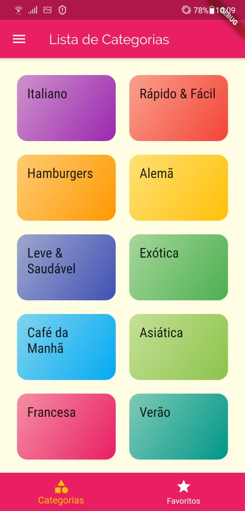
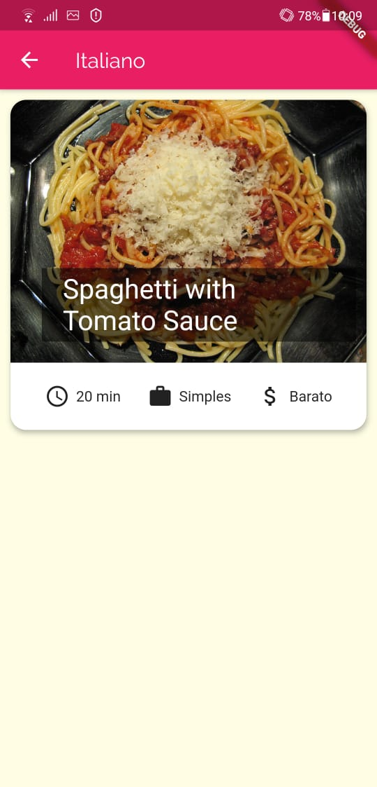
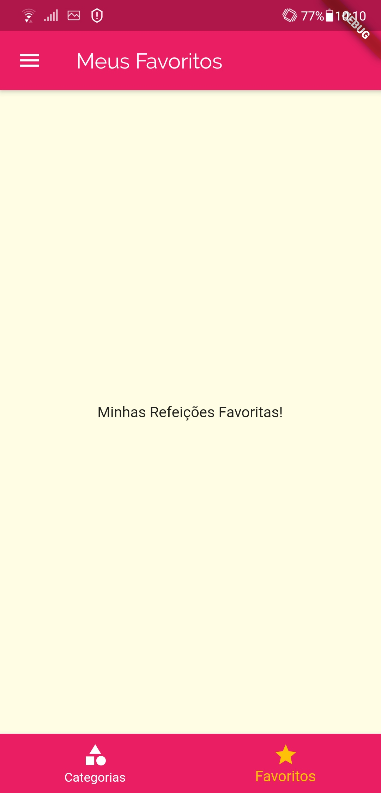
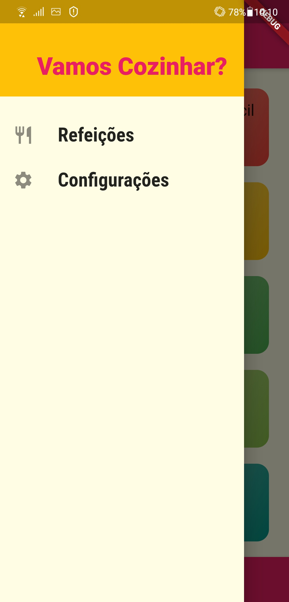
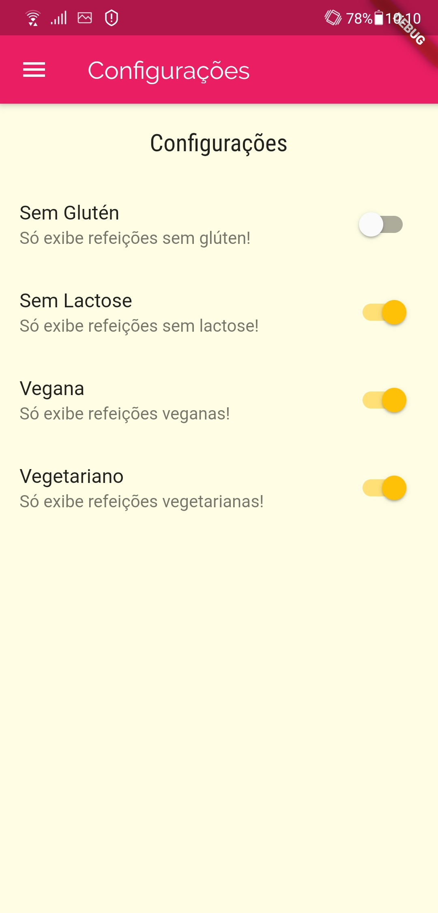

# Meals

Um novo projeto Flutter com conceitos basicos.

## Começando
Abra o seu Prompt de Comando, se estiver no Windows, ou seu Terminal, caminhe ate o diretório desejado para criar o repositório e digite flutter create meals <<< Pode-se trocar o "shop" pelo o nome que achar melhor
Após isso, coloque esse conteúdo lá dentro

## Screenshots

### Tela inicial
Aqui é a tela inicial, onde mostra todas as categorias de alimentos do aplicativo. Quando clicar em uma categoria irá mostrar os alimentos localizados nela
<table>
  <tr>
    <td>Tela inicial com as categorias</td>
     <td>Itens de uma categoria, onde mostra o tempo, a complexibilidade, o preço e a foto da refeição</td>
  </tr>
  <tr>
    <td valign="top"></td>
    <td valign="top"></td>
  </tr>
 </table>

### Favoritos
Logo mais abaixo, ao lado de Categorias, há uma aba chamada Favoritos onde você pode salvar suas comidas favoritas!! 

### Menu
No canto superior esquerdo há um menu com as opções do aplicativo
<table>
  <tr>
    <td>Menu com as opções</td>
    <td>Tela da opção "Refeições"</td>
    <td>Tela da opção "Configurações", aqui você define as configurações gerais do aplicativo, neste caso os tipos de refeições</td>
  </tr>
  <tr>
    <td valign="top"></td>
    <td valign="top"></td>
    <td valign="top"></td>
  </tr>
 </table>
